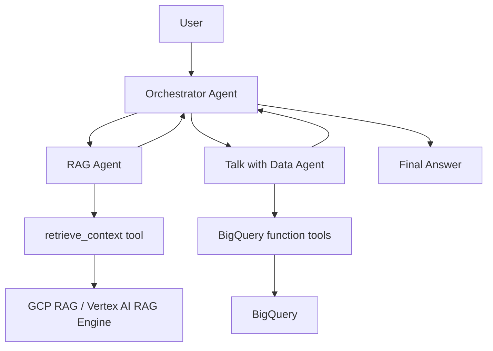

# TheLook Retail Intelligence Assistant

This project teaches students how to build a modular multi-agent system with:
- an **Orchestrator Agent**,
- a **Conversational RAG Agent**, and
- a **Talk with Data Agent** using BigQuery-style function tools.

The implementation intentionally uses a minimal ReAct style: each agent keeps small
tool-use instructions in plain ADK `Agent(...)` declarations, without custom planner
classes or extra orchestration code.

It is framed as a fictional ecommerce analytics assistant for sales, customers,
products, inventory, returns, marketing, and operating policies.

## 1) Project Objective

Build a teaching-friendly architecture where TheLook Retail questions are routed to:
- unstructured knowledge retrieval (RAG),
- structured analytics (BigQuery),
- or both, when interpretation needs policy + data together.

Structured data source:

```text
bigquery-public-data.thelook_ecommerce
```

The dataset is part of BigQuery public datasets: Google hosts the storage, and
students only need a billing project for the queries they run. Keep examples small
with selected columns, filters, and `LIMIT`.

Starter tables:
- `users`
- `orders`
- `order_items`
- `products`
- `inventory_items`

Starter joins:
- `orders.user_id = users.id`
- `order_items.order_id = orders.order_id`
- `order_items.product_id = products.id`
- `inventory_items.product_id = products.id`

Local RAG source:

```text
docs/company_policies/
```

## 2) Architecture



## 3) Folder Structure

- `orchestrator/`: the ADK Dev UI app — `agent.py` exports `root_agent`, and `rag_agent.py` / `talk_with_data_agent.py` are the specialist sub-agents it orchestrates. Run `adk web src/project` and pick **orchestrator**.
- `tools/`: optional MCP-style wrappers around service abstractions
- `services/`: RAG and BigQuery services with mock and real BigQuery implementations
- `docs/company_policies/`: synthetic policy documents for local RAG examples
- `config/`: environment-driven settings
- `prompts/`: explicit prompt contracts
- `mcp/`: conceptual toolbox config and simple custom MCP server example
- `examples/`: sample questions and outputs
- `tests/`: pytest coverage for retrieval and data safety behaviors

## 4) How the Three Agents Work

### Orchestrator Agent
- Declared as a plain ADK `Agent`.
- Uses `AgentTool` to call the RAG and Talk with Data agents.
- Routes to RAG, BigQuery data, or both using concise ecommerce-focused instructions.

### Conversational RAG Agent
- Declared as a plain ADK `Agent`.
- Uses a `retrieve_context` function tool.
- Uses synthetic policy docs for refunds, revenue recognition, inventory risk, regional targets, and marketing KPIs.
- Answers only from retrieved content.
- Returns citations when present.
- Says when evidence is insufficient.

### Talk with Data Agent
- Declared as a plain ADK `Agent`.
- Discovers available tables and inspects schema through function tools.
- Converts analytical question into SQL using discovered schema.
- Uses function tools to run read-only queries.
- Starts with the five core TheLook ecommerce tables.
- Refuses destructive commands (DELETE/UPDATE/INSERT/DROP/TRUNCATE/ALTER).
- Returns business-friendly summary plus SQL and assumptions.

## 5) RAG Abstraction

`services/rag_service.py` defines `RagService` + `MockRagService` and a placeholder `VertexRagService`.

This keeps agent logic independent from a specific RAG backend.

## 6) BigQuery Tool Abstraction

- `services/bigquery_service.py` defines mock and real BigQuery services with read-only safety checks.
- `orchestrator/talk_with_data_agent.py` exposes ADK function tools for table listing, schema inspection, and read-only SQL.
- `tools/bigquery_mcp_tools.py` keeps an optional MCP-style wrapper for later integration.
- `mcp/tools.yaml` shows conceptual MCP toolbox wiring.
- `mcp/bigquery_mcp_server.py` demonstrates a simple custom MCP server pattern.

Implemented safeguards:
- Only one SQL statement is allowed.
- Only `SELECT` / `WITH` read queries are accepted.
- Destructive and administrative keywords are blocked before execution.
- Real BigQuery runs a dry run before execution.
- Queries are restricted to `BIGQUERY_DATASET_PROJECT.BIGQUERY_DATASET`.
- Queries are restricted to `BIGQUERY_ALLOWED_TABLES`.
- `BIGQUERY_MAX_BYTES_BILLED`, `BIGQUERY_QUERY_TIMEOUT_SECONDS`, and `BIGQUERY_MAX_RESULT_ROWS` cap cost and result size.

## 7) Run Locally with Mocks

`adk web <folder>` treats **each immediate subfolder** of `<folder>` as a separate app and expects that subfolder to contain `agent.py` defining `root_agent`. The app here is `orchestrator/`, so point `adk web` at its parent (`src/project`):

```bash
uv run --project src/project adk web src/project
```

Then pick **orchestrator** in the Dev UI.

By default `USE_MOCK_SERVICES=true`, so no GCP credentials are required.

## 8) Configure Real GCP BigQuery

### Enable APIs

BigQuery needs the [BigQuery API](https://cloud.google.com/bigquery/docs/service-dependencies). Service account impersonation also needs the [Service Account Credentials API](https://docs.cloud.google.com/docs/authentication/use-service-account-impersonation). Vertex AI is only needed later if you replace the mock RAG service.

```bash
gcloud config set project YOUR_BILLING_PROJECT_ID
gcloud services enable bigquery.googleapis.com
gcloud services enable iamcredentials.googleapis.com
# Later, for real Vertex AI RAG:
gcloud services enable aiplatform.googleapis.com
```

### Create a runtime service account

Use a dedicated service account for the agent instead of broad user credentials or JSON keys.

```bash
gcloud iam service-accounts create talk-with-data-agent \
  --display-name="Talk with Data Agent"
```

Grant least-privilege [BigQuery IAM](https://docs.cloud.google.com/iam/docs/roles-permissions/bigquery) access:
- Project level: `roles/bigquery.jobUser` so the agent can create query jobs.
- Public dataset reads do not require granting dataset IAM on `bigquery-public-data`.
- For your own private dataset later, grant dataset-level `roles/bigquery.dataViewer` on only the dataset the agent can inspect and query.

```bash
PROJECT_ID=YOUR_BILLING_PROJECT_ID
SA_EMAIL=talk-with-data-agent@$PROJECT_ID.iam.gserviceaccount.com

gcloud projects add-iam-policy-binding $PROJECT_ID \
  --member="serviceAccount:$SA_EMAIL" \
  --role="roles/bigquery.jobUser"
```

For dataset-level `roles/bigquery.dataViewer` on private datasets, use BigQuery Console > dataset > Sharing > Permissions, or manage it with Terraform (`google_bigquery_dataset_iam_member`). Avoid granting project-wide `dataViewer` unless the agent should query every dataset in the project.

### Authenticate locally

For quick local development, [Application Default Credentials](https://docs.cloud.google.com/bigquery/docs/authentication/getting-started) with your user account works:

```bash
gcloud auth application-default login
gcloud auth application-default set-quota-project YOUR_BILLING_PROJECT_ID
```

For a closer production test, impersonate the runtime service account. Your user needs `roles/iam.serviceAccountTokenCreator` on that service account.

```bash
gcloud auth application-default login \
  --impersonate-service-account=talk-with-data-agent@YOUR_BILLING_PROJECT_ID.iam.gserviceaccount.com
```

Avoid downloading service account JSON keys. Google recommends [more secure alternatives](https://docs.cloud.google.com/iam/docs/best-practices-service-accounts) when possible; if your organization requires keys, keep them out of git and set `GOOGLE_APPLICATION_CREDENTIALS` only in your local shell or secret manager-backed runtime.

### Authenticate when deployed

On Cloud Run, Compute Engine, GKE, or another Google Cloud runtime, attach the `talk-with-data-agent` service account to the workload. The Python BigQuery client will pick it up through ADC automatically.

For workloads outside Google Cloud, prefer [Workload Identity Federation](https://docs.cloud.google.com/iam/docs/best-practices-for-using-workload-identity-federation) over long-lived service account keys.

### Environment

Copy `.env.example` to `.env` or export these variables:

```bash
USE_MOCK_SERVICES=false
GOOGLE_CLOUD_PROJECT=YOUR_BILLING_PROJECT_ID
BIGQUERY_DATASET_PROJECT=bigquery-public-data
BIGQUERY_DATASET=thelook_ecommerce
BIGQUERY_ALLOWED_TABLES=users,orders,order_items,products,inventory_items
BIGQUERY_LOCATION=US
BIGQUERY_MAX_BYTES_BILLED=1000000000
BIGQUERY_QUERY_TIMEOUT_SECONDS=30
BIGQUERY_MAX_RESULT_ROWS=100
```

## 9) Example Questions

- What are the top 10 product categories by revenue?
- Which countries generated the highest number of orders?
- What is the return rate by product category?
- Which products have high sales but low inventory availability?
- Based on the refund policy, which product categories should be reviewed because of high return rates?
- According to the inventory risk policy, which products may need restocking priority?

## 10) Suggested Student Exercises

1. Improve orchestrator intent classification with richer rules.
2. Add date parsing and explicit time filters in SQL generation.
3. Integrate a real Vertex AI RAG Engine corpus.
4. Add query parameters for more controlled filters.
5. Add evaluation tests for factual grounding and safety.

## Quick Commands

```bash
uv run --project src/project pytest
uv run --project src/project adk web src/project
```
