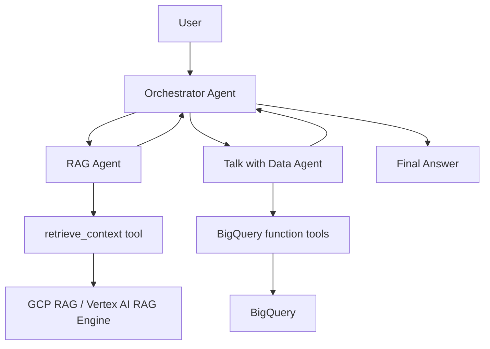

# Agentic Talk with Data + RAG (Google ADK-style Educational Project)

This project teaches students how to build a modular multi-agent system with:
- an **Orchestrator Agent**,
- a **Conversational RAG Agent**, and
- a **Talk with Data Agent** using BigQuery-style function tools.

The implementation intentionally uses a minimal ReAct style: each agent keeps small
tool-use instructions in plain ADK `Agent(...)` declarations, without custom planner
classes or extra orchestration code.

It is designed to run locally with mocks first, then evolve toward real Google Cloud integrations.

## 1) Project Objective

Build a teaching-friendly architecture where user questions are routed to:
- unstructured knowledge retrieval (RAG),
- structured analytics (BigQuery),
- or both, when interpretation needs policy + data together.

## 2) Architecture



## 3) Folder Structure

- `app/`: ADK entrypoint that exports `root_agent`
- `agents/`: orchestrator + specialist agents
- `tools/`: optional MCP-style wrappers around service abstractions
- `services/`: RAG and BigQuery service interfaces with mock implementations
- `config/`: environment-driven settings
- `prompts/`: explicit prompt contracts
- `mcp/`: conceptual toolbox config and simple custom MCP server example
- `examples/`: sample questions and outputs
- `tests/`: pytest coverage for retrieval and data safety behaviors

## 4) How the Three Agents Work

### Orchestrator Agent
- Declared as a plain ADK `Agent`.
- Uses `AgentTool` to call the RAG and Talk with Data agents.
- Routes to RAG, data, or both using concise instructions.

### Conversational RAG Agent
- Declared as a plain ADK `Agent`.
- Uses a `retrieve_context` function tool.
- Answers only from retrieved content.
- Returns citations when present.
- Says when evidence is insufficient.

### Talk with Data Agent
- Declared as a plain ADK `Agent`.
- Discovers available tables and inspects schema through function tools.
- Converts analytical question into SQL using discovered schema.
- Uses function tools to run read-only queries.
- Refuses destructive commands (DELETE/UPDATE/INSERT/DROP/TRUNCATE/ALTER).
- Returns business-friendly summary plus SQL and assumptions.

## 5) RAG Abstraction

`services/rag_service.py` defines `RagService` + `MockRagService` and a placeholder `VertexRagService`.

This keeps agent logic independent from a specific RAG backend.

## 6) BigQuery Tool Abstraction

- `services/bigquery_service.py` defines service contract and read-only safety checks.
- `agents/talk_with_data_agent.py` exposes ADK function tools for table listing, schema inspection, and read-only SQL.
- `tools/bigquery_mcp_tools.py` keeps an optional MCP-style wrapper for later integration.
- `mcp/tools.yaml` shows conceptual MCP toolbox wiring.
- `mcp/bigquery_mcp_server.py` demonstrates a simple custom MCP server pattern.

## 7) Run Locally with Mocks

From repository root:

```bash
adk web src/project/agents
```

By default `USE_MOCK_SERVICES=true`, so no GCP credentials are required.

## 8) Configure Real GCP Services Later

1. Copy `.env.example` to `.env` (or export env vars another way).
2. Set `USE_MOCK_SERVICES=false`.
3. Implement TODO sections in:
   - `VertexRagService`
   - `RealBigQueryService`
4. Configure MCP toolbox or custom server for real BigQuery.

## 9) Example Questions

- What does the company policy say about revenue recognition?
- What were total sales by region last quarter?
- Based on the policy threshold, is the EMEA region underperforming?

## 10) Suggested Student Exercises

1. Improve orchestrator intent classification with richer rules.
2. Add date parsing and explicit time filters in SQL generation.
3. Integrate a real Vertex AI RAG Engine corpus.
4. Replace mock BigQuery service with a live MCP BigQuery server.
5. Add evaluation tests for factual grounding and safety.

## Quick Commands

```bash
pytest src/project/tests
adk web src/project/agents
```
